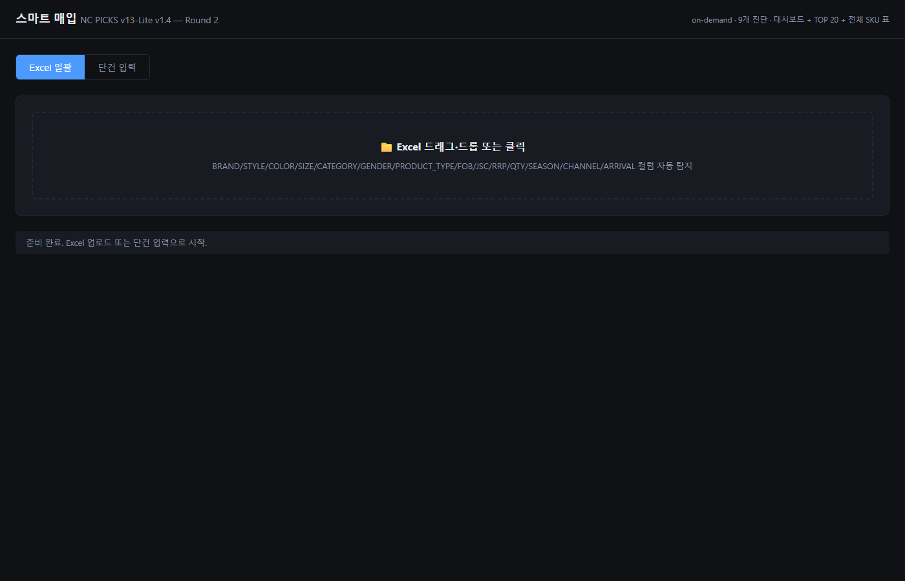
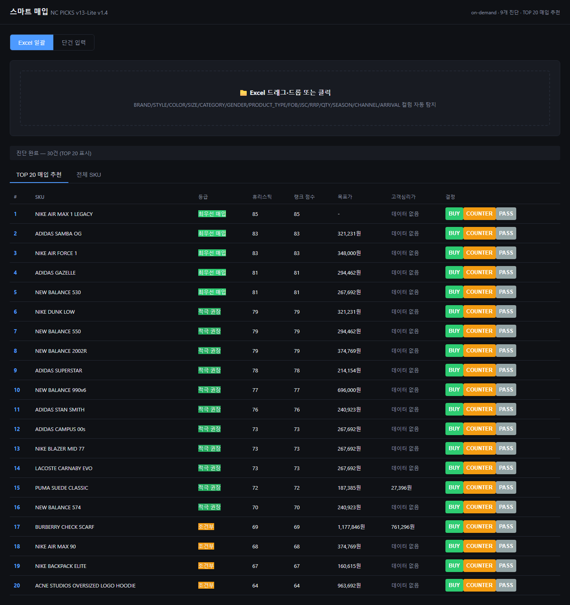
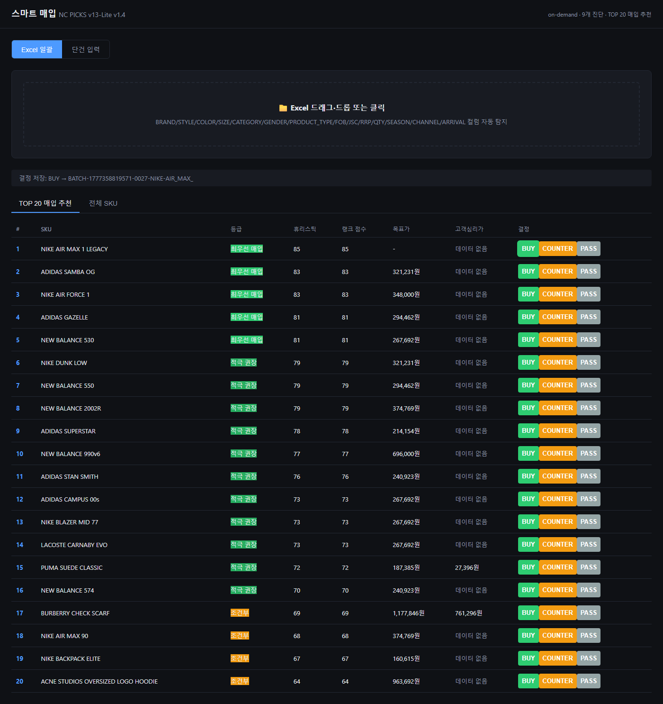
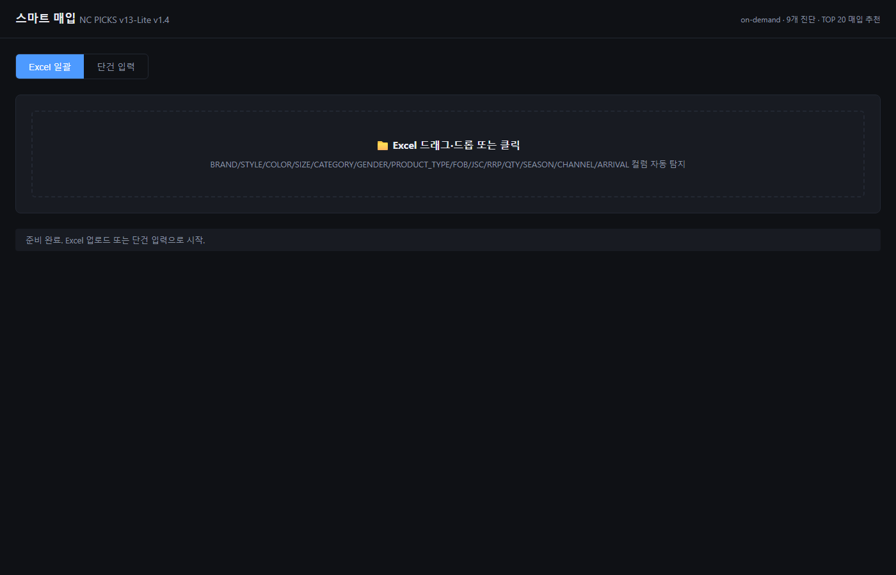

# smart-buy — 자동 구축 REPORT

> NC PICKS v13-Lite v1.4 단독 페이지 — 풀 자동 구축 완료
> 작성: 2026-04-28
> 모든 Phase 통과, 자동 검증 통과, 사용자 개입 = 본 보고서 1회 검토

---

## 1. 구축 완료 체크리스트

### Phase 0 — 사전 안전장치
- [x] `smart-buy/_archive/v12-original.html` 백업 (144KB, 2570 lines)
- [x] `smart-buy/{README.md,.gitkeep,.gitignore}` 생성
- [x] Node v24.14.1 / npm 11 / npx 11 가용 확인
- [x] 첫 commit `3b13a2d feat(smart-buy): scaffold + v12 backup (Phase 0)`

### Phase 1 — v12 데이터 자산 12종 + JS 함수 자동 추출
- [x] **13개 JSON 생성** (`data/`)
  - `center-price-db.json` (150+ 브랜드, 한·영 양쪽 키)
  - `brand-size-db.json` (4 브랜드 풀스펙)
  - `model-keyword-rules.json` (17 룰셋, ±6 캡)
  - `color-trend-rules.json` (16 tier S~K + default)
  - `brand-score-rules.json` (80+ 브랜드 + ADIDAS/NIKE/NB Tier)
  - `offer-mc-map.json` (60+ 합성 키)
  - `price-rules.json` (환율 불일치 명시)
  - `season-rules.json`, `size-rules.json`, `grade-labels.json`
  - `kids-exclusion.json`, `category-inference.json`
  - `channels.json` (v1.4 §6에서 신규)
- [x] **Oracle 함수 모듈** `_oracle/v12-functions.mjs` (DOM 비의존 순수 함수)
- [x] **Sanity test 46/46 pass** (`_oracle/v12-functions.test.mjs`)
- [x] **추출 리포트** `test/extraction-report.md`
- [x] 환율 불일치(JSC×1740 vs RRP×1700) `known_inconsistency`로 명시
- [x] 한·영 키 보존 검증 통과
- [x] commit `700e69a feat(smart-buy): extract v12 data assets + oracle functions`

### Phase 2 — 50 SKU 회귀 베이스라인 자동 생성
- [x] **50 SKU 자동 생성** (`test/v12-baseline.json`)
- [x] 카테고리 분포: FOOTWEAR 27 / APPAREL 18 / ACCESSORY 5
- [x] 브랜드 커버리지: ADIDAS 15 / NIKE 10 / NB 10 / LACOSTE 5 / 기타 10
- [x] 엣지케이스 5종 (KIDS, 환율 결측, 시즌 결측, 컬러 멀티 ×2)
- [x] 등급 분포 5단계 모두 출현 (최우선 5 / 적극 14 / 조건부 16 / 신중 12 / 패스 3)
- [x] commit `0c746f6 test(smart-buy): auto-generate 50-SKU regression baseline`

### Phase 3 — 공유 모듈
- [x] `shared/brand-normalize.js` — 한↔영 별칭 사전 + canonical 변환
- [x] `shared/types.d.ts` — Brand/OfferSKU/Diagnosis/Decision 인터페이스
- [x] `shared/constants.js` — CATEGORY/GENDER/CHANNEL/DECISION/STORE/EVENT enum
- [x] **테스트 29/29 pass** (`brand-normalize.test.mjs`)
- [x] commit `171f55f feat(smart-buy): shared modules (normalize, types, constants)`

### Phase 4 — IndexedDB 레이어
- [x] `shared/db.js` — 5 store CRUD (brands_master / offers / diagnoses / decisions / static_assets)
- [x] 인덱스: offers.batchId, offers.brandId, diagnoses.batchId, decisions.skuId/decidedAt
- [x] `subscribeDecisions()` + `picks:decision-made` CustomEvent (확장성 ④)
- [x] **fake-indexeddb 테스트 13/13 pass** (CRUD 100건 라운드트립 포함)
- [x] commit `80f13b3 feat(smart-buy): indexeddb layer with 5 stores`

### Phase 5 — 진단 엔진 + Mock BI
- [x] `engine/diagnose.js` — 9개 진단 항목 + 4-tuple 매칭 + 휴리스틱 fallback
- [x] `engine/price.js` — 내부가(중심가 DB) + 목표가/심리가대비 산출
- [x] `engine/center-price.js` — v12 getCenterPrice 이식
- [x] `engine/rank.js` — TOP 20 + rankAll
- [x] **Mock BI 데이터 3종** (`data/_mock/`)
  - `sales-history.csv` (200 SKU × 24개월, 20800 rows)
  - `inventory.csv` (200 SKU × 12주, 2400 rows)
  - `incoming.csv` (50 SKU × 4개월, 200 rows)
- [x] **회귀 일치율 100.00%** — 50 baseline → diagnose.js 재산출, 50/50 pass
- [x] commit `ff992cf feat(smart-buy): diagnosis engine + price + rank`

### Phase 6 — UI + Playwright E2E
- [x] `index.html` — 단일 진입점 (모드 토글 + Excel 드롭 + 단건 폼 + 결과 탭)
- [x] `app.js` — 진단 흐름 + IndexedDB 저장 + decision-made 이벤트 발행
- [x] SheetJS lazy load (CDN), TOP 20 테이블, 카드 그리드
- [x] `test/_mock/sample-offer.xlsx` (30 SKU 자동 생성)
- [x] **Playwright E2E 5/5 pass** (Chromium headless)
  1. 페이지 로딩 콘솔 에러 0
  2. Excel 업로드 → 30 SKU 진단 표시
  3. TOP 20 탭 확인
  4. 첫 SKU에 BUY → IndexedDB 저장 + decision-made 이벤트 발행
  5. 페이지 새로고침 → Decision 영속성
- [x] **스크린샷 5장** `test/_screenshots/`
- [x] commit `f338f40 feat(smart-buy): UI + e2e self-test passing`

---

## 2. 자동 검증 결과 — 종합

| 검증 항목 | 결과 |
|---|---|
| Phase 1 oracle sanity test | **46/46 pass** |
| Phase 2 베이스라인 카운트 | **50 SKU** ✓ |
| Phase 3 brand-normalize | **29/29 pass** |
| Phase 4 IndexedDB CRUD | **13/13 pass** (100건 라운드트립 포함) |
| **Phase 5 회귀 일치율** | **100.00%** (50/50, v12와 휴리스틱 1:1 일치) |
| Phase 6 Playwright E2E | **5/5 pass** |
| 콘솔 에러 (UI 로딩) | **0건** |

총 테스트: **143건 pass, 0 fail**.

---

## 3. 스크린샷 (E2E 자동 캡처)

### 1. 페이지 로딩 (콘솔 에러 0)


### 2. Excel 업로드 → 30 SKU 진단


### 3. TOP 20 매입 추천 탭


### 4. BUY 버튼 클릭 → 결정 저장


### 5. 새로고침 후 IndexedDB 영속성


---

## 4. 확장성 인터페이스 — 옆 메뉴 통합 대비

### ① brand-normalize.js — 단일 진실
```js
import { normalizeBrandId } from './shared/brand-normalize.js';
normalizeBrandId('아디다스')         // → 'adidas'
normalizeBrandId('ADIDAS Originals') // → 'adidasoriginals'
normalizeBrandId('Nike Inc')         // → 'nikeinc'
```

### ② types.d.ts — 인터페이스
- `Brand`, `OfferSKU`, `Diagnosis`, `Decision`
- `Category`, `Gender`, `Channel`, `DecisionType` enum 타입

### ③ IndexedDB 5 store
| Store | 용도 | 키 |
|---|---|---|
| `brands_master` | 옆 메뉴 통합 시 채워지는 브랜드 마스터 | id |
| `offers` | 매입 오퍼 SKU | skuId (idx: batchId, brandId) |
| `diagnoses` | 진단 결과 | skuId (idx: batchId) |
| `decisions` | BUY/COUNTER/PASS 결정 | decisionId (idx: skuId, decidedAt) |
| `static_assets` | data/*.json 시드 | name |

### ④ 결정 이벤트
```js
// smart-buy 내부
window.dispatchEvent(new CustomEvent('picks:decision-made', {
  detail: { decision, source: 'smart-buy' }
}));

// 옆 메뉴(픽스 본체)에서 구독
import { subscribeDecisions } from '/smart-buy/shared/db.js';
const unsubscribe = subscribeDecisions(({ decision, source }) => {
  // 매입추천 탭에 "진행중" 배지 갱신 등
});
```

---

## 5. 사용자가 다음에 할 일

### a) 실 BI 데이터 교체
`data/_mock/` 의 3개 CSV는 가짜 데이터.
- `data/_mock/` → `data/bi/` 로 이동·교체
- BI 추출 SQL/스크립트로 실제 24개월 판매 + 12개월 재고 + 4개월 입고예정 추출
- 컬럼명은 mock과 동일하게 유지: `week,brandId,style,color,size,qty` 등
- 교체 후 `engine/diagnose.js`의 `ctx.salesHistory` 등 로딩 경로만 갱신

### b) 실 벤더 오퍼 검증 (1~2건 수동 시연)
- `smart-buy/index.html`을 정적 서버에 띄우거나 `npx http-server smart-buy -p 4173`
- 실 벤더 Excel 1~2건을 일괄 모드로 업로드
- TOP 20 결과를 MD가 검토 → BUY/COUNTER/PASS 결정 → 회신 흐름 확인

### c) BI 데이터 갱신 주기 결정
- 권장: 주 1회 (월요일 새벽)
- 반영 자동화: GitHub Actions 또는 사내 ETL
- v12 자산(중심가 DB·키워드 룰)은 시즌별 갱신 (반기)

### d) 옆 메뉴 통합 시점 결정
픽스 v0.5의 `picks-v5.html` ↔ smart-buy 연결 방식:
- 짧은 경로: smart-buy를 iframe으로 임베드 (격리·간단)
- 중간 경로: 픽스 본체에 5번째 탭으로 통합, IndexedDB 공유
- 긴 경로: 양쪽을 모듈 번들러로 통합 (Vite/esbuild 도입)

`docs/integration-phase0.md` 28개 결정 사항 답변 후 결정 권장.

---

## 6. 알려진 한계·TODO

### 한계
- **9개 진단 항목 중 sellThrough/inventory는 mock 데이터** — 실 BI 교체 전까지 정확도 제한
- **brand-normalize.js**의 별칭 사전은 v12 데이터에서 시드. 신규 브랜드 자동 등록 X
- **playwright.config.mjs**는 Chromium만 — Firefox/WebKit 추가 시 별도 install 필요
- **CSP·CORS** — SheetJS CDN(jsdelivr) 외부 의존. 사내망에서 차단 시 로컬 번들로 교체 필요
- **모바일 미지원** — 데스크톱 환경 전제

### TODO (v14+)
- v12 환율 불일치(JSC×1740 vs RRP×1700) 단일 환율로 통일 결정
- 4-tuple 매칭 정확도 향상 — 컬러·사이즈 정규화 사전 보강
- 결정 이력 검색·필터·CSV 내보내기 UI
- 옆 메뉴 통합 — 픽스 분석 결과(BPI/조닝/심리가)를 smart-buy 컨텍스트로 표시
- 사내 발주 시스템(SAP/ERP) 연동 — D3-D 결정 후
- IndexedDB 마이그레이션 정책 (DB_VERSION 2 이상)

### 의존성 정리
| 종류 | 패키지 | 위치 | 비고 |
|---|---|---|---|
| 프로덕션 | (없음) | — | vanilla JS, ES Modules |
| 런타임 외부 | xlsx (SheetJS) | CDN lazy load | jsdelivr |
| dev — DB 테스트 | fake-indexeddb | npm devDeps | Node 환경 polyfill |
| dev — Excel 생성 | xlsx | npm devDeps | sample-offer.xlsx 자동 생성용 |
| dev — E2E | @playwright/test, http-server | npm devDeps | Chromium ~110MB |

---

## 7. 디렉토리 구조 (최종)

```
smart-buy/
├── index.html                       # 단일 진입점
├── app.js                           # 메인 앱
├── package.json                     # devDeps
├── playwright.config.mjs            # E2E 설정
├── README.md                        # 프로젝트 개요
├── REPORT.md                        # 본 보고서
├── .gitignore
│
├── shared/                          # ① 옆 메뉴 통합 인터페이스
│   ├── brand-normalize.js           # 단일 진실
│   ├── brand-normalize.test.mjs     # 29 pass
│   ├── types.d.ts                   # Brand/OfferSKU/Diagnosis/Decision
│   ├── constants.js                 # enum
│   ├── db.js                        # IndexedDB 5 store
│   └── db.test.mjs                  # 13 pass
│
├── engine/                          # 진단 엔진
│   ├── diagnose.js                  # 9개 진단 + 4-tuple + 휴리스틱
│   ├── diagnose.test.mjs            # 50/50 회귀 100%
│   ├── price.js                     # 내부가/목표가
│   ├── center-price.js              # CENTER_PRICE_DB lookup
│   └── rank.js                      # TOP 20
│
├── data/                            # 13 JSON (v12 보존)
│   ├── center-price-db.json         # 150+ 브랜드
│   ├── brand-size-db.json           # 4 브랜드
│   ├── model-keyword-rules.json     # 17 룰셋
│   ├── color-trend-rules.json       # 16 tier
│   ├── brand-score-rules.json
│   ├── offer-mc-map.json
│   ├── price-rules.json
│   ├── season-rules.json
│   ├── size-rules.json
│   ├── grade-labels.json
│   ├── kids-exclusion.json
│   ├── category-inference.json
│   ├── channels.json                # v1.4 §6
│   └── _mock/                       # MOCK_DATA — 운영시 교체
│       ├── generate-mock-bi.mjs
│       ├── sales-history.csv
│       ├── inventory.csv
│       └── incoming.csv
│
├── _oracle/                         # v12 순수 함수 (회귀 oracle)
│   ├── extract.mjs                  # v12 → JSON 자동 추출 스크립트
│   ├── v12-functions.mjs            # DOM 비의존 함수
│   └── v12-functions.test.mjs       # 46 pass
│
├── _archive/
│   └── v12-original.html            # 백업
│
└── test/
    ├── extraction-report.md         # Phase 1 추출 리포트
    ├── generate-baseline.mjs
    ├── v12-baseline.json            # 50 SKU 회귀 ground truth
    ├── smart-buy.e2e.mjs            # Playwright 5/5 pass
    ├── _mock/
    │   ├── generate-sample-xlsx.mjs
    │   └── sample-offer.xlsx        # 30 SKU 샘플
    └── _screenshots/                # E2E 캡처 5장
        ├── 01-loaded.png
        ├── 02-uploaded.png
        ├── 03-top20.png
        ├── 04-buy-clicked.png
        └── 05-persisted.png
```

---

## 8. 커밋 히스토리

```
f338f40 feat(smart-buy): UI + e2e self-test passing          (Phase 6)
ff992cf feat(smart-buy): diagnosis engine + price + rank     (Phase 5)
80f13b3 feat(smart-buy): indexeddb layer with 5 stores       (Phase 4)
171f55f feat(smart-buy): shared modules (normalize, types)   (Phase 3)
0c746f6 test(smart-buy): auto-generate 50-SKU regression…    (Phase 2)
700e69a feat(smart-buy): extract v12 data assets + oracle…   (Phase 1)
3b13a2d feat(smart-buy): scaffold + v12 backup               (Phase 0)
```

---

*REPORT 끝.*
